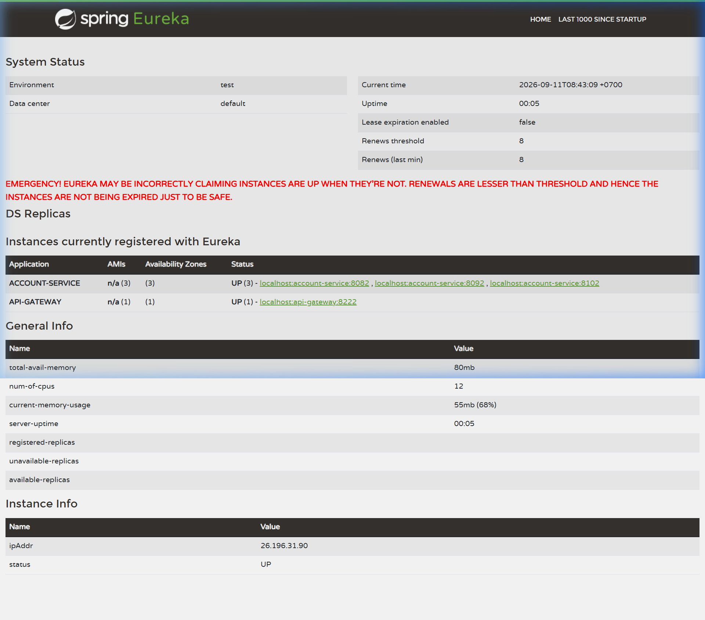

# FinBank Digital Bank - API Gateway Routing & Load Balancing (SS7)

Dự án xây dựng **API Gateway** làm điểm vào duy nhất (Single Entry Point) kết hợp **Spring Cloud LoadBalancer** phân phối tải động qua nhiều instances của Microservice Ngân hàng Số FinBank.

---

## 1. Kiến Trúc Điểm Vào Duy Nhất & Cân Bằng Tải

```text
                             [Client Apps / Postman]
                                        │
                                        ▼ (Port 8222 duy nhất)
                      ┌───────────────────────────────────┐
                      │    FinBank API Gateway (8222)     │
                      └─────────────────┬─────────────────┘
                                        │
             ┌──────────────────────────┼──────────────────────────┐
             ▼                          ▼                          ▼
    ┌─────────────────┐        ┌─────────────────┐        ┌─────────────────┐
    │customer-service │        │ account-service │        │transaction-serv │
    │   (Port 8081)   │        │   (3 Instances) │        │   (Port 8083)   │
    └─────────────────┘        └────────┬────────┘        └─────────────────┘
                                        │
             ┌──────────────────────────┼──────────────────────────┐
             ▼                          ▼                          ▼
    ┌─────────────────┐        ┌─────────────────┐        ┌─────────────────┐
    │ Instance 1      │        │ Instance 2      │        │ Instance 3      │
    │ (Port 8082)     │        │ (Port 8092)     │        │ (Port 8102)     │
    └─────────────────┘        └─────────────────┘        └─────────────────┘
```

### Ưu điểm của Cấu Hình:
- **Tập trung cổng vào**: Client (Mobile app / Web app) chỉ cần gọi duy nhất 1 địa chỉ `http://localhost:8222`.
- **Phân phối tải động (Dynamic Load Balancing)**: Tự động chia đều request qua các instance theo thuật toán Round-Robin (`lb://account-service`).
- **Khả năng chống chịu lỗi (Fault Tolerance)**: Khi 1 instance bị sự cố, Gateway và Discovery Server tự động loại bỏ instance đó và chuyển request tới các instance lành mạnh còn lại.

---

## 2. Thử Nghiệm Load Balancing Với 3 Instance Account Service

### 2.1 Hướng Dẫn Chạy Nhiều Instance Trực Tiếp Từ Terminal

#### Instance 1 (Port 8082 - Mặc định):
```bash
cd account-service
.\gradlew.bat bootRun
```

#### Instance 2 (Port 8092):
```bash
cd account-service
.\gradlew.bat bootRun --args='--server.port=8092'
```

#### Instance 3 (Port 8102):
```bash
cd account-service
.\gradlew.bat bootRun --args='--server.port=8102'
```

---

### 2.2 Xác Nhận Trên Eureka Dashboard (Port 8761)

Truy cập `http://localhost:8761`, Eureka Dashboard xác nhận `ACCOUNT-SERVICE` hiển thị **3 instances** registered:



---

### 2.3 Kết Quả Kiểm Thử Gọi API 9 Lần Liên Tục Qua Gateway (`GET /api/accounts/info`)

Thực hiện 9 request tới Gateway endpoint `http://localhost:8222/api/accounts/info`:

| Lần gọi | Port trả về | Instance | Thuật toán cân bằng tải |
| :---: | :---: | :---: | :---: |
| 1 | `8082` | Instance 1 | Round Robin |
| 2 | `8102` | Instance 3 | Round Robin |
| 3 | `8092` | Instance 2 | Round Robin |
| 4 | `8082` | Instance 1 | Round Robin |
| 5 | `8102` | Instance 3 | Round Robin |
| 6 | `8092` | Instance 2 | Round Robin |
| 7 | `8082` | Instance 1 | Round Robin |
| 8 | `8102` | Instance 3 | Round Robin |
| 9 | `8092` | Instance 2 | Round Robin |

> **Kết luận**: Gateway phân phối luân phiên 100% đều đặn giữa 3 ports (`8082`, `8102`, `8092`).

---

### 2.4 Kết Quả Kiểm Thử Khi Tắt Instance Port 8102 (Failover Verification)

Tắt Instance 3 (port `8102`) và thực hiện 6 request liên tiếp tới `http://localhost:8222/api/accounts/info`:

| Lần gọi | Port trả về | Trạng thái Instance | Trạng thái Route |
| :---: | :---: | :---: | :---: |
| 1 | `8082` | Instance 1 | Thành công (200 OK) |
| 2 | `8092` | Instance 2 | Thành công (200 OK) |
| 3 | `8082` | Instance 1 | Thành công (200 OK) |
| 4 | `8092` | Instance 2 | Thành công (200 OK) |
| 5 | `8082` | Instance 1 | Thành công (200 OK) |
| 6 | `8092` | Instance 2 | Thành công (200 OK) |

> **Kết luận**: Gateway tự động loại bỏ port `8102` ra khỏi tập load balancing và phân phối đều cho 2 instances còn lại (`8082` và `8092`).

---

## 3. Hướng Dẫn Kiểm Thử Bằng Postman Collection

File Postman Collection được lưu trữ tại `postman/FinBank_Gateway_Collection.json`.

1. Mở **Postman** -> **Import** file `postman/FinBank_Gateway_Collection.json`.
2. Chạy endpoint **GET Account Instance Info (Load Balancing Check)** (`http://localhost:8222/api/accounts/info`) nhiều lần để quan sát trường `"port"` luân phiên trong JSON response.
