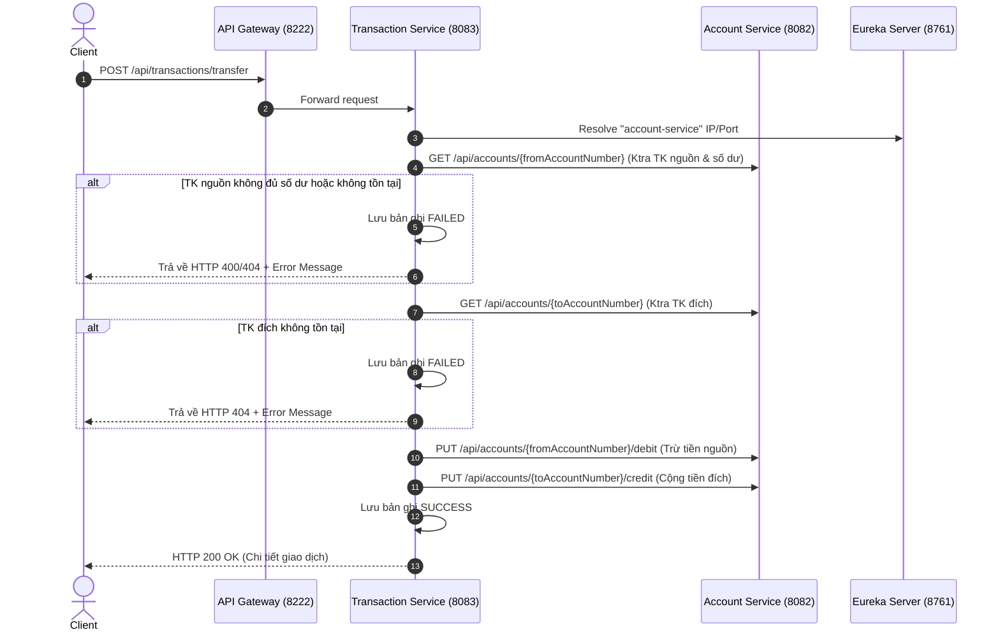

# SS7 - Bài Tập Tổng Hợp 3: Giao tiếp đồng bộ giữa các Microservice bằng RestTemplate

## 🎯 1. Mục tiêu bài tập
- Thực hành xây dựng luồng giao tiếp đồng bộ (Synchronous Communication) giữa các Microservice trong hệ thống FinBank.
- Cấu hình `RestTemplate` kết hợp `@LoadBalanced` để gọi `account-service` qua tên Eureka (`http://account-service`) thay vì hard-code IP:Port.
- Xử lý các kịch bản lỗi khi giao dịch: không đủ số dư, tài khoản không tồn tại, revert hoàn tiền khi lỗi.
- Kiểm thử toàn bộ hệ thống thông qua **API Gateway (Port 8222)**.

---

## 🏛️ 2. Kiến trúc & Các Service

| Service | Port | Vai trò |
| :--- | :--- | :--- |
| **`discovery-server`** | `8761` | Eureka Server đăng ký và phát hiện dịch vụ |
| **`api-gateway`** | `8222` | API Gateway định tuyến request cho toàn hệ thống |
| **`account-service`** | `8082` | Quản lý thông tin tài khoản, số dư, thực hiện debit/credit |
| **`transaction-service`** | `8083` | Quản lý giao dịch, thực hiện chuyển tiền đồng bộ qua RestTemplate |

---

## 🔄 3. Quy trình chuyển tiền (Transfer Workflow)

Khi Client gửi request **`POST http://localhost:8222/api/transactions/transfer`**:



---

## 🛠️ 4. Hướng dẫn khởi chạy

### Bước 1: Khởi động Eureka Server & Gateway
```bash
# Terminal 1: Discovery Server
cd discovery-server
.\gradlew.bat bootRun

# Terminal 2: API Gateway
cd api-gateway
.\gradlew.bat bootRun
```

### Bước 2: Khởi động Account & Transaction Services
```bash
# Terminal 3: Account Service (Port 8082)
cd account-service
.\gradlew.bat bootRun

# Terminal 4: Transaction Service (Port 8083)
cd transaction-service
.\gradlew.bat bootRun
```

Dữ liệu tài khoản mẫu được khởi tạo sẵn khi ứng dụng chạy:
- **Tài khoản `1001`**: Chủ TK `Nguyen Van A`, số dư `10,000,000 VND`
- **Tài khoản `1002`**: Chủ TK `Tran Thi B`, số dư `5,000,000 VND`

---

## 🧪 5. Hướng dẫn kiểm thử trên Postman

Tất cả request được thực hiện qua **API Gateway (Port 8222)**. File collection đã được export tại `postman/FinBank_Transfer_Collection.json`.

### 📌 **Test Case 1: Chuyển tiền thành công (2,000,000 VND từ 1001 -> 1002)**
- **Method**: `POST`
- **URL**: `http://localhost:8222/api/transactions/transfer`
- **Body JSON**:
  ```json
  {
      "fromAccountNumber": "1001",
      "toAccountNumber": "1002",
      "amount": 2000000,
      "description": "Chuyển tiền thanh toán hóa đơn"
  }
  ```
- **Kết quả mong muốn**: `status: "SUCCESS"`, `errorMessage: null`.
- **Kiểm tra số dư sau chuyển**:
  - `GET http://localhost:8222/api/accounts/1001/balance` -> `balance: 8000000.0`
  - `GET http://localhost:8222/api/accounts/1002/balance` -> `balance: 7000000.0`

---

### 📌 **Test Case 2: Chuyển tiền thất bại (Vượt quá số dư)**
- **Method**: `POST`
- **URL**: `http://localhost:8222/api/transactions/transfer`
- **Body JSON**:
  ```json
  {
      "fromAccountNumber": "1001",
      "toAccountNumber": "1002",
      "amount": 100000000,
      "description": "Chuyển tiền vượt quá số dư"
  }
  ```
- **Kết quả mong muốn**: HTTP 400 Bad Request, `status: "FAILED"`, `errorMessage: "Số dư tài khoản nguồn không đủ..."`.

---

### 📌 **Test Case 3: Chuyển tiền tới tài khoản không tồn tại (`9999`)**
- **Method**: `POST`
- **URL**: `http://localhost:8222/api/transactions/transfer`
- **Body JSON**:
  ```json
  {
      "fromAccountNumber": "1001",
      "toAccountNumber": "9999",
      "amount": 1000000,
      "description": "Chuyển tiền tới tài khoản không tồn tại"
  }
  ```
- **Kết quả mong muốn**: HTTP 404 Not Found, `status: "FAILED"`, `errorMessage: "Tài khoản đích (9999) không tồn tại"`.
