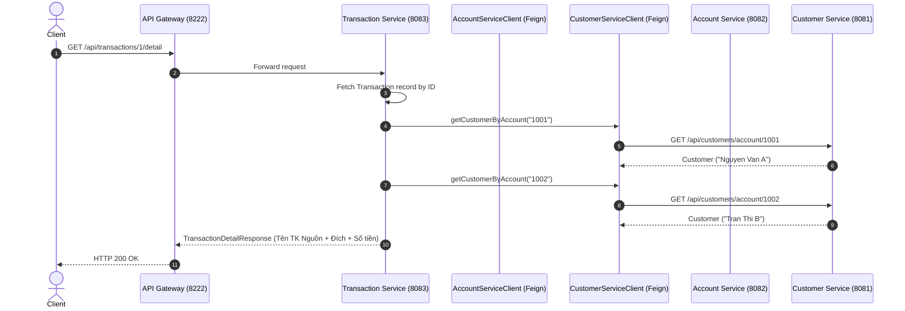

# SS7 - Bài Tập Tổng Hợp 4: Chuyển đổi từ RestTemplate sang FeignClient (OpenFeign)

## 🎯 1. Mục tiêu bài tập
- Chuyển đổi toàn bộ cơ chế gọi API đồng bộ trong `transaction-service` từ imperative **RestTemplate** sang declarative **Spring Cloud OpenFeign**.
- Khai báo 2 FeignClient interface:
  - `AccountServiceClient`: Gọi `account-service` (Port `8082`) để kiểm tra tài khoản, số dư, thực hiện debit/credit.
  - `CustomerServiceClient`: Gọi `customer-service` (Port `8081`) để lấy thông tin tên khách hàng theo số tài khoản.
- Xây dựng API mới **`GET /api/transactions/{id}/detail`** tổng hợp dữ liệu từ cả 3 Microservices (Transaction + Account + Customer).
- Định tuyến toàn bộ request qua **API Gateway (Port 8222)**.

---

## 🏛️ 2. Danh sách các Microservices

| Service | Port | Vai trò |
| :--- | :--- | :--- |
| **`discovery-server`** | `8761` | Eureka Server phát hiện dịch vụ |
| **`api-gateway`** | `8222` | API Gateway định tuyến `/api/customers/**`, `/api/accounts/**`, `/api/transactions/**` |
| **`customer-service`** | `8081` | Quản lý thông tin khách hàng (Khởi tạo sẵn CUST001 - Nguyen Van A, CUST002 - Tran Thi B) |
| **`account-service`** | `8082` | Quản lý tài khoản & số dư (Khởi tạo sẵn 1001: 10M VND, 1002: 5M VND) |
| **`transaction-service`** | `8083` | Quản lý giao dịch, chuyển tiền & ghép dữ liệu chi tiết bằng OpenFeign |

---

## 🔄 3. Kiến trúc FeignClient & Luồng ghép dữ liệu `/detail`



---

## 📝 4. So sánh RestTemplate vs FeignClient (OpenFeign)

> **Nhận xét & Đánh giá:**
> 1. **Khả năng đọc & bảo trì (Readability & Maintainability):** FeignClient vượt trội hơn hẳn so với RestTemplate nhờ cơ chế khai báo (declarative) bằng Interface và Anotation (`@GetMapping`, `@PutMapping`). Developer chỉ cần khai báo phương thức giống hệt controller mà không phải tự gán URL thủ công.
> 2. **Rút gọn dung lượng code (Boilerplate Code Reduction):** Sử dụng RestTemplate đòi hỏi tạo URL string, tạo `HttpEntity`, thiết lập `HttpHeaders`, và tự gắp `ResponseEntity.getBody()`. FeignClient tự động xử lý toàn bộ quá trình mã hóa/giải mã JSON và binding kiểu dữ liệu trả về một cách trong suốt.
> 3. **Tích hợp hệ sinh thái Microservice:** FeignClient tự động tích hợp sẵn với Spring Cloud LoadBalancer và Eureka Service Discovery. Khi gọi `@FeignClient(name = "account-service")`, Feign tự động phân giải IP:Port và cân bằng tải mà không cần cấu hình thêm `RestTemplate` bean phức tạp.

---

## 🛠️ 5. Hướng dẫn chạy & Kiểm thử

### Khởi chạy hệ thống:
```bash
# Terminal 1: Discovery Server (8761)
cd discovery-server && .\gradlew.bat bootRun

# Terminal 2: API Gateway (8222)
cd api-gateway && .\gradlew.bat bootRun

# Terminal 3: Customer Service (8081)
cd customer-service && .\gradlew.bat bootRun

# Terminal 4: Account Service (8082)
cd account-service && .\gradlew.bat bootRun

# Terminal 5: Transaction Service (8083)
cd transaction-service && .\gradlew.bat bootRun
```

### Kiểm thử trên Postman (Collection `postman/FinBank_Feign_Transfer_Collection.json`):
- **Test Case 1 - Chuyển tiền qua FeignClient (2,000,000 từ 1001 -> 1002)**:
  `POST http://localhost:8222/api/transactions/transfer` -> `status: "SUCCESS"`.
- **Test Case 2 - Lấy chi tiết giao dịch kèm tên khách hàng**:
  `GET http://localhost:8222/api/transactions/1/detail`
  - Output JSON:
    ```json
    {
      "id": 1,
      "transactionId": "TXN-544951A6",
      "fromAccountNumber": "1001",
      "fromCustomerName": "Nguyen Van A",
      "toAccountNumber": "1002",
      "toCustomerName": "Tran Thi B",
      "amount": 2000000.0,
      "description": "Chuyển tiền qua OpenFeign",
      "status": "SUCCESS",
      "errorMessage": null,
      "createdAt": "2026-09-13T20:15:00.000000"
    }
    ```
- **Test Case 3 - Chuyển tiền vượt quá số dư**:
  `POST http://localhost:8222/api/transactions/transfer` (100,000,000 VND) -> `HTTP 400 Bad Request`.
- **Test Case 4 - Chuyển tiền tới TK 9999 không tồn tại**:
  `POST http://localhost:8222/api/transactions/transfer` -> `HTTP 404 Not Found`.
